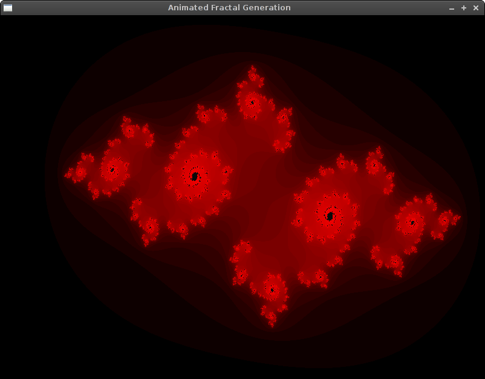
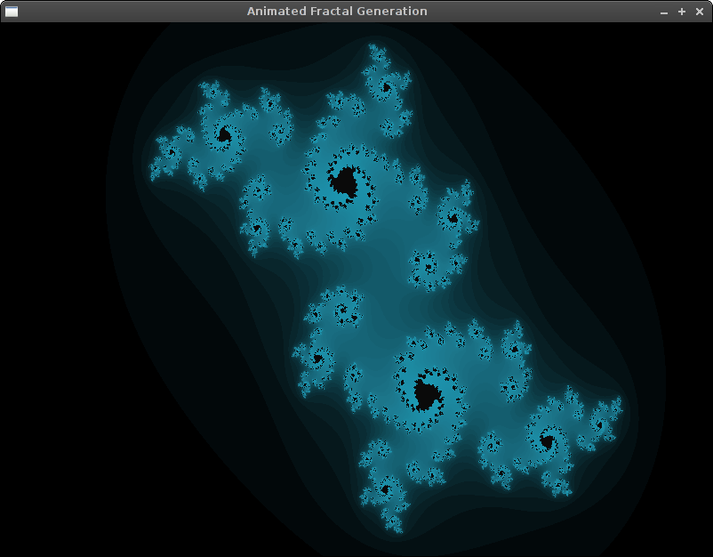
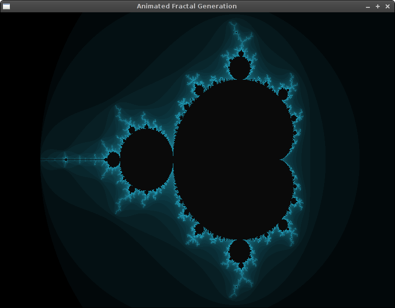
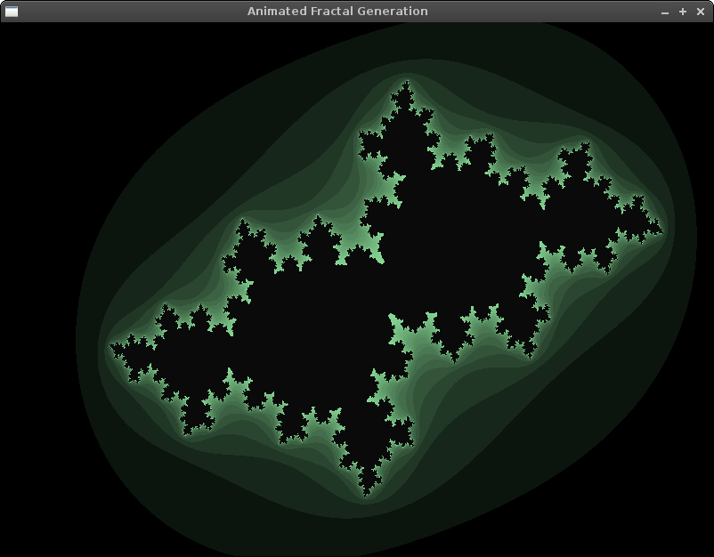
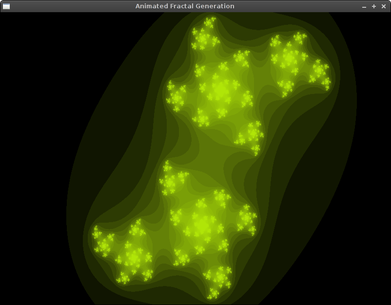

# Fractal generator by Traiko Dinev

#### Build instructions
1. Do a "cabal build" to resolve any dependencies. If that fails,
try installing the Gloss framework "cabal install gloss". Everything else
should be included by default in GHC.
2. "cabal run" does the trick. I don't advise you to run it via GHCI,
because it usually impedes performance.

#### Usage instructions
1. The coolest way to use it is to press random (6) and look at the cool stuff
being generated.
2. Otherwise, you could select a preset, which I have somewhat carefully chosen.

#### Screenshots

#### Notice
I've been playing with the random for hours now. Be careful!
